<p align="center"></p>

# Listening Post

A curated AI vendor release radar for the Omarchy bar that keeps working
where RSS does not. The pill only speaks when a model shipped, the bill
changed, or a provider is down; the panel is a drainable queue, not a feed.

```
                              nothing new: the slot collapses
AI: 3 new                     releases or pricing changes you have not seen
OpenAI incident               a provider status page has an open incident
```

## Why this is not another RSS reader

- **The source list is the product.** Twenty-nine curated feeds across every
  major lab, provider, and AI tool. For the vendors that publish no
  first-party blog feed (Anthropic, xAI, Mistral, Meta, and more), Listening
  Post pulls a curated community RSS mirror for news plus their GitHub release
  atoms for SDK versions, so the radar keeps working where marketing sites
  drop RSS. Every shipped URL was fetched live before release.
- **Lanes, not folders.** Every item is classified: **Model releases**,
  **Pricing and limits**, **Status incidents** (louder, first), and
  **Engineering posts** (shown, never counted, never notified). A vendor's
  same-week release burst clusters into one row.
- **Ranked by the agents you actually run.** With the first-party Agents
  plugin installed, Listening Post reads the file *names* in its usage
  folder (read-only, nothing parsed, degrades to off) and floats those
  vendors to the top.
- **Quiet by design.** Install starts read. Engineering chatter never
  reaches the pill. Nothing new means no pill at all.

## Install

```bash
omarchy plugin add https://github.com/jeremylongshore/omarchy-listening-post-entry --enable
```

Then add **Listening Post** to your bar layout (Omarchy menu, Bar, or
`~/.config/omarchy/shell.json`). The background service starts polling on
enable; the first poll lands within a minute.

## Remove

```bash
omarchy plugin remove io.github.jeremylongshore.listening-post
```

State lives in `~/.local/state/omarchy/listening-post/` and is safe to
delete at any time; the next poll rebuilds it.

## The panel

Standard Omarchy panel keys, same as the Herald and the first-party panels:

| Key | Action |
| --- | --- |
| `j` / `k` or arrows | Move the cursor |
| `Enter` or `o` | Open the item in your browser |
| `x` or `a` | Mark the selected row read |
| `c` | Mark everything read |
| `r` | Refresh now |
| `Esc` | Close |
| `Tab` / `Shift+Tab` | Switch to the neighboring bar panel |

Left-click opens, right-click marks read. Middle-click the pill to refresh.

## Sources

Twenty-nine curated sources.

- **Vendor news (first-party RSS):** OpenAI, Google AI, Google DeepMind,
  Hugging Face, Together AI.
- **Vendor news (community RSS mirror, for vendors with no first-party
  feed):** Anthropic (news, engineering, research), xAI, Mistral, Meta,
  Cohere, Groq, Perplexity.
- **AI commentary and research:** The Batch, The Verge AI, Chip Huyen,
  Lil'Log.
- **Status incidents:** Claude Status, OpenAI Status.
- **Releases and changelogs:** Claude Code (releases and changelog), the
  Anthropic / xAI / Mistral SDKs, Ollama, vLLM, MCP Servers, Cursor.

The community RSS mirror ([Olshansk/rss-feeds](https://github.com/Olshansk/rss-feeds))
is third-party and labeled as such; every source is polled independently, so
if the mirror lags, only those rows go quiet. Add your own feeds with OPML at
any time.

A changelog feed (Claude Code, Cursor) never headlines the release lane: its
entries collapse into one quiet "Cursor changelog · N this week" row, so a
routine version bump never masquerades as a model release.

Add your own with OPML:

```bash
~/.config/omarchy/plugins/io.github.jeremylongshore.listening-post/bin/listening-post-poll --import-opml my-feeds.opml
~/.config/omarchy/plugins/io.github.jeremylongshore.listening-post/bin/listening-post-poll --export-opml > listening-post.opml
```

Imported feeds must be https and land in the blog lane with the same
classification rules.

## Notifications

Only two things notify: a **new model release** and a **new unresolved
status incident**. Notifications ride `omarchy-notification-send`, so they
land in whatever notification center you run, click-to-open included. More
than three new items in one poll collapse into a single summary. Changelog
commits and engineering posts never notify. Turn it all off in settings.

## Settings

| Setting | Default | What it does |
| --- | --- | --- |
| Desktop notifications | On | New releases and unresolved incidents only |
| Rank by agents you use | On | Read-only file listing of the Agents plugin usage folder |

Polling cadence is fixed at 15 minutes, the same house rate the first-party
Agents plugin uses. Feed publishing cadence is hours; polling harder buys
nothing and costs the publishers.

## Architecture

```
bin/listening-post-poll   the only network and the only writer (node CLI)
        |  curl -fsS --proto =https --max-filesize, one GET per source
        v
~/.local/state/omarchy/listening-post/state.json   atomic tmp+mv
        ^
        |  read only
Service.qml (timer)   BarWidget.qml + Panel.qml (render + keys)
```

The QML side never touches the network and never writes a file. Every
mutation, including mark-read, is a call into the poller CLI, so the entire
I/O surface of this plugin is one auditable script. Parsing, classification,
merging, and sanitizing live in `Model.js`, pure functions loaded by the
shell, the CLI, and the unit suite alike.

Network hosts contacted (GET only): the curated feed hosts (`openai.com`,
`blog.google`, `deepmind.google`, `huggingface.co`, `together.ai`,
`raw.githubusercontent.com`, `theverge.com`, `huyenchip.com`,
`lilianweng.github.io`, `status.claude.com`, `status.openai.com`,
`code.claude.com`, `cursor.com`, `github.com`), plus anything you import via
OPML (https only). No account, no token, no telemetry, nothing sent anywhere.

## Testing

```bash
npm test
```

72 tests over the pure data layer: the RSS and Atom parsers against captured
bodies from all twenty-nine live sources, lane classification, week clustering,
merge and retention, read-state, notification gating, personalization
mapping, OPML round-trip, and the state record. Offline by design; the
capture procedure is in `docs/FIXTURES.md`.

## License

MIT
